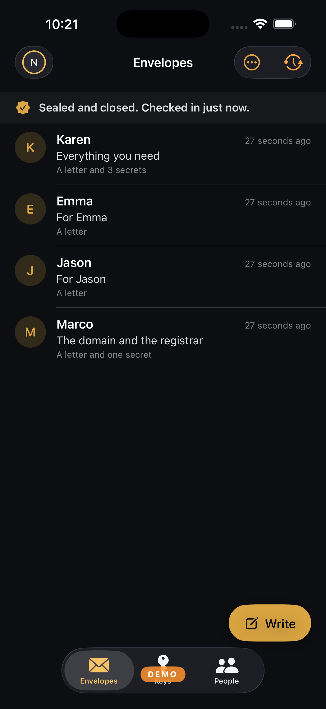
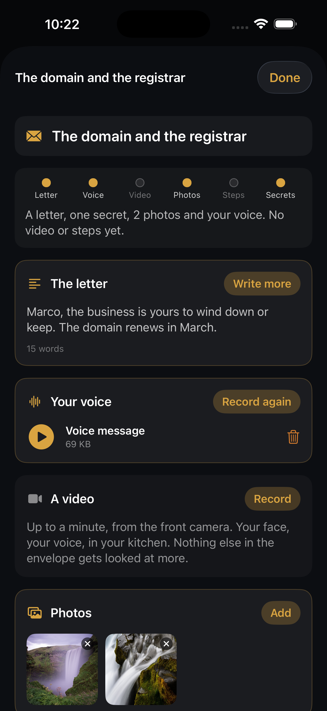
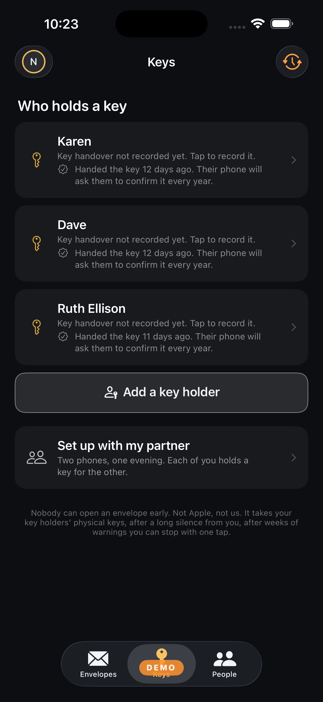
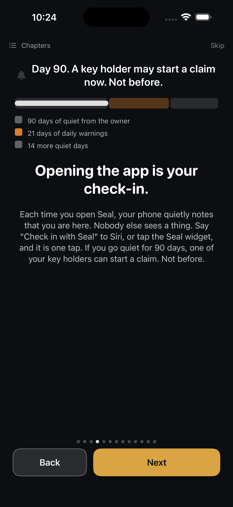

<p align="center">
  
</p>

<h1 align="center">Seal</h1>

<p align="center"><b>Sealed envelopes for the people you leave behind.</b></p>

<p align="center">
  <a href="LICENSE"></a>
  
  
  
  
</p>

<p align="center">
  <a href="https://sealmessenger.com">Website</a> ·
  <a href="https://sealmessenger.com/how-it-works.html">How it works</a> ·
  <a href="https://sealmessenger.com/limits.html">What it does not do</a> ·
  <a href="https://sealmessenger.com/objections.html">The objections, answered</a> ·
  <a href="SECURITY.md">Report a vulnerability</a>
</p>

---

After you die, your will goes through a court and what is in it becomes a
public record that anyone can look up. So the password to your bank, the
phrase that opens your wallet, where the safe deposit key is, the combination,
the thing you never told anybody: none of it can go in one.

Seal is where those things go instead. You write a small number of envelopes,
one per person: a letter, photos, a voice message, a video, a file, and the
secrets. You choose a few people you trust, face to face, and hand each a
piece of one key. You set the rule for how the envelopes open after you are
gone. Then you open the app now and then, and that is the whole ongoing job.

Nobody can open one early. Not Apple, not us. There is no Seal server: the
encrypted envelopes sit in Apple's iCloud under Seal's own container (not your
personal iCloud storage), the keys never leave the phones,
and the record of who did what can be checked with a script that has no Seal
in it.

> **If you own a hardware wallet, do not make Seal the only copy of a live
> seed phrase yet.** Nobody independent has audited it. What your family
> cannot reconstruct without you is *where the steel plate is, which wallet it
> belongs to, and who to call first*, and none of that needs the twelve words.
> Start there.

## Status, plainly

| | |
|---|---|
| Stage | Submitted to the App Store, September 2026. Free on [TestFlight](https://testflight.apple.com/join/cYp9JRCG) until then. |
| Audit | **None.** One design review before release, by the same assistant that wrote much of the code, found two things worth fixing; both are fixed. See [`docs/REVIEW.md`](docs/REVIEW.md). |
| Team | One developer. No company, no funding, no investors. |
| Platform | iPhone and iPad, iOS 18 and later. No Android. One owner device. ML-KEM and the on-phone writing help need iOS 26. |
| Dependencies | None. No third party code, no analytics, no crash reporter, no backend of ours. |
| Price | One purchase, once. No subscription. Holding a key or receiving an envelope is free. |

`docs/GOTCHAS.md` is the running list of things that went wrong and what they
actually were. It is unflattering on purpose, and it is the first thing to
read before debugging anything.

## What is not done

Not a complete list. [`docs/PRE_AUDIT.md`](docs/PRE_AUDIT.md) is written for a
reviewer and [the limits page](https://sealmessenger.com/limits.html) has the
rest.

- **Nobody independent has reviewed the cryptography or the code.**
- **Registering a hardware key for somebody else has never met real hardware.**
  It is the one place private key material leaves a phone, and it deserves the
  hardest look of anything here.
- **Security keys are barely tested.** The interop matrix in
  `docs/SECURITY_KEY_TEST_MATRIX.md` has no rows filled in. Passkeys are the
  better tested path today.
- **Most tests only run on a phone**, at debug launch, watched only by the
  developer. `SecurityFixTests` is not registered, so it does not run at all.
  The key split and the countdown compile on their own and anybody can run
  them: `sh tools/run_core_tests.sh`.
- **No reproducible builds.** You cannot prove the binary Apple ships is built
  from this source.
- **There is no cryptographic time lock.** Nothing can enforce one without a
  trusted third party, and Seal has none on purpose. The countdown is a signed
  public record that honest apps obey, so M key holders plus the recipient
  could act together to open early. That is the trust the owner chose.
- **The timestamp authority is a placeholder.** `docs/RECORD.md` section 13
  says why the current free public one is not yet a defensible choice.
- **The field arithmetic in the key split is not constant time**, accepted
  because shares are only ever handled on their holder's own device.
- **Claim reasons and objection notes are stored in the clear.**

## What it looks like

<p align="center">
  
  
  
  
</p>

## How it works

1. **Register** with a passkey or a security key. That credential is your
   identity. There is no password, no email and no recovery code, so there is
   nothing a phishing message could ask you for. Face ID alone is enough; a
   hardware key is optional.
2. **Meet people in person.** You add somebody by standing next to them, once.
   Each phone records the other's public key in that moment and refuses any
   different key served under that name afterwards, forever.
3. **Write envelopes.** One per person: a letter, photos, a voice message, a
   video, a file, and the secrets. You can start before you have added anybody,
   by typing a name. Seal can interview you and draft the letter, and it can
   read an attached PDF and propose "what to do first" steps. All of that runs
   on the phone, and none of it leaves.
4. **Choose who can open them** and **set the rule.** Any two of three, after
   90 days of silence, then 21 days of warnings, then 14 quiet days, by
   default. You choose all four numbers. Each envelope picks its rule, so a
   medical letter can open in days while the rest wait months.
5. **Tap Seal.** Everything is encrypted on the phone before it leaves.
6. **Open the app now and then.** That is the check-in that keeps it closed.

If you go quiet past your limit, somebody you chose can start a claim. You are
warned every day for weeks, then a quiet period runs. One tap from you ends all
of it, and that tap never needs your hardware key: a living person who lost a
key must not be declared dead by their own software. Only after all of that can
keys be tapped, and each envelope then opens on the phone of the person it was
written for. Nobody reads anybody else's, including the people who released it.

## Check it without trusting us

Anybody holding part of an estate can export a **capsule**: one JSON file with
the whole signed record. `tools/verify_capsule.py` is a single Python file with
no Seal in it and no network access. It checks every device endorsement as a
WebAuthn assertion, every event's digest and signature, that each event's link
names an event that is present, that every epoch's commitments match what the
owner signed, every key tap against the challenge naming that claim, and every
RFC 3161 token. With `openssl` on the path it also checks the token signatures.

```sh
python3 tools/verify_capsule.py seal-capsule-XXXX.json --strict
```

What it cannot do is prove the record is complete. The owner and several key
holders write to it at the same time with no server to order them, so hiding an
event is only detectable by comparing capsules held by different people, or
through the timestamp tokens.

`tools/make_test_capsule.py` builds a synthetic one, so you can watch it pass,
change a byte, and watch it fail. The format is documented in
`docs/CAPSULE.md` in enough detail to write a fresh verifier from scratch,
deliberately, in case this project is not here.

## Read the code first

The most useful thing a stranger can do today is read, not write. Six files, in
the order [SECURITY.md](SECURITY.md) puts them. Between them they decide who can
unwrap what, what one key holder learns alone, when a release is allowed, and
whether a key was really tapped.

| File | What |
|---|---|
| `Seal/Estate/EstateKeys.swift` | Every wrap and unwrap in the estate |
| `Seal/Crypto/KEMBundle.swift` | X25519 plus ML-KEM-768 |
| `Seal/Crypto/Shamir.swift` | The key split, over GF(256) |
| `Seal/Estate/ReleaseMachine.swift` | The countdown, as a pure function |
| `Seal/Crypto/WebAuthnParsing.swift` | Assertion checks: RP hash, user presence, type |
| `tools/verify_capsule.py` | The standalone verifier |

[`docs/PRE_AUDIT.md`](docs/PRE_AUDIT.md) is written for a reviewer: where to
attack in order, and the weak spots already accepted. It ends with the commands
that reproduce the key split, a synthetic capsule and its verification on any
machine, with no Mac and no phone. Those same commands run on every push.

## The key hierarchy

```
Envelope Content Key   random 256 bit, AES-256-GCM, one per envelope
    listed in
Key Table              one per RECIPIENT, under its own random Key Table Key
    reachable two ways
    ├─ wrapped to the OWNER's devices
    └─ encrypted under the Estate Key, then wrapped to the RECIPIENT's devices
Estate Key             one per rule per epoch
    reachable two ways
    ├─ wrapped to the OWNER's devices
    └─ split by Shamir into N shares, threshold M, each wrapped to one
       key holder's devices
```

The same thing in the usual notation, for people who read that faster:

```
c_env      = Enc(m, k_env)                            one random k_env per envelope
Table_r    = Enc({k_env, ...}, k_table_r)             one table per recipient r
k_table_r  reachable two ways:
             Wrap(k_table_r, pk_owner)
             Wrap(Enc(k_table_r, K_estate), pk_r)     needs recipient's phone AND K_estate
K_estate   = Shamir split into s_1 .. s_N, threshold M
s_i        = Wrap(s_i, pk_holder_i)                   one piece per key holder
```

Wrap is X25519 plus ML-KEM-768 through HKDF-SHA256. Enc is AES-256-GCM with
the estate, epoch and purpose in the AAD.

The people who release an estate recover the Estate Key and **nothing else**.
It opens no envelope on its own: each key table still needs the phone of the
person it was written for. A rule is a separate estate with its own Estate
Key, so releasing the urgent envelopes reveals nothing about the rest.

## Cryptography

All from Apple's CryptoKit and AuthenticationServices. Nothing rolled by hand.

| | |
|---|---|
| Identity | WebAuthn, P-256 ECDSA with SHA-256, in a security key or a passkey |
| Device keys | P-256 in the Secure Enclave, non-exportable, endorsed by the identity |
| Wrapping | X25519 ECDH plus ML-KEM-768, combined through HKDF-SHA256. ML-KEM needs iOS 26, so a wrap to a device below that is X25519 alone, and the wrap records which of the two it used |
| Content | AES-256-GCM with a domain separated AAD naming estate, epoch and purpose |
| Key split | Shamir over GF(256), checked against independent Python vectors |
| Time | RFC 3161 tokens on check-ins, cancellations, claims, taps, releases, departures and each published epoch; each phone also clamps a claim to the day it first saw it, so nobody can backdate one past the warnings |
| Storage | CloudKit public database: ciphertext and public keys. World readable, and any signed-in Apple account can write to it, so every reader checks signatures and drops the rest. No Seal server. |

## Where things are

| Path | What |
|---|---|
| `Seal/Crypto/` | Shamir, the X25519 plus ML-KEM bundle, WebAuthn parsing, AES wrapping |
| `Seal/Estate/` | The estate engine, keys, the release machine, rules, first-seen clamp |
| `Seal/Record/` | The signed, hash linked record and timestamp tokens |
| `Seal/Ceremony/` | Adding a person: scan, verify, tap |
| `Seal/Identity/` | Passkey and security key registration and sign in |
| `Seal/Sync/` | CloudKit reads and writes. The only place the network is touched |
| `Seal/Views/` | SwiftUI. `Onboarding/` is the first minute |
| `Seal/SelfTest/` | The tests. They run at every DEBUG launch and black the screen on failure |
| `tools/` | The standalone capsule verifier and the test capsule maker |
| `site/` | sealmessenger.com, static, deployed with `npx wrangler deploy` |
| `docs/` | The documents below |

## Documentation

| | |
|---|---|
| `docs/PRODUCT.md` | What it is, who it is for, and §8: what is not promised |
| `docs/SDS.md` | Security design, key hierarchy, §7 threat model |
| `docs/RELEASE.md` | The countdown and the release state machine, and §13: a rule per envelope |
| `docs/CAPSULE.md` | The archive format, for an outsider with a file and a laptop |
| `docs/RECORD.md` | The signed record and timestamping |
| `docs/REVIEW.md` | The pre-release design review: what was found, what was fixed |
| `docs/GOTCHAS.md` | What already went wrong, and what it turned out to be |
| `HANDOFF.md` | Where this stands today, including what is blocking |

## Building

Xcode 26 to compile, an iPhone or iPad on iOS 18 or later to run it, and an Apple Developer account for the
CloudKit container and the WebAuthn associated domain. New Swift files under
`Seal/` join the target automatically. The `EstateEvent` record type needs its
`estate` field queryable in CloudKit, and `Identity` needs `recordName`
queryable, in both the development and production environments.

Tests live in the app target under `Seal/SelfTest/`, because there is no test
host for a passkey. They run on every DEBUG launch; a failure blacks the screen
and prints which suite. The scheme has `-SealDemoMode` for a phone full of
made-up envelopes and key holders, used for screenshots and demos.

## Contributing

Pull requests are welcome for bugs, tests and documentation. Please read
`docs/GOTCHAS.md` first, keep every new Swift file under the MPL notice, and do
not add a dependency: there are none, and that is a feature the whole project
rests on.

A finding goes to [SECURITY.md](SECURITY.md) if it lets somebody read, forge,
release or stop something; anything else is an issue.

## Paying for the audit

Seal has not been independently audited, and an audit by an outside firm
costs more than a one-person project has earned. If you want to move that
day closer, anything sent here goes toward it, and the audit report goes
in this repo when it is done.

[PayPal](https://www.paypal.com/paypalme/jasonepage) ·
[Venmo](https://venmo.com/u/Jason-page-85)

## License

[Mozilla Public License 2.0](LICENSE). File level copyleft: you may read,
audit, run and fork this, and you may build something larger around it under
whatever terms you like, but changes to Seal's own files have to be published
under the same license.

MPL rather than GPL or AGPL on purpose. GPL family licenses conflict with the
App Store's terms, which is why VLC was pulled in 2011 and why VideoLAN
relicensed to MPL to come back. An estate product that cannot ship on the App
Store is not a product.

Every source file carries the notice from Exhibit A, because MPL is decided
per file and a file without the notice is arguably not covered.
